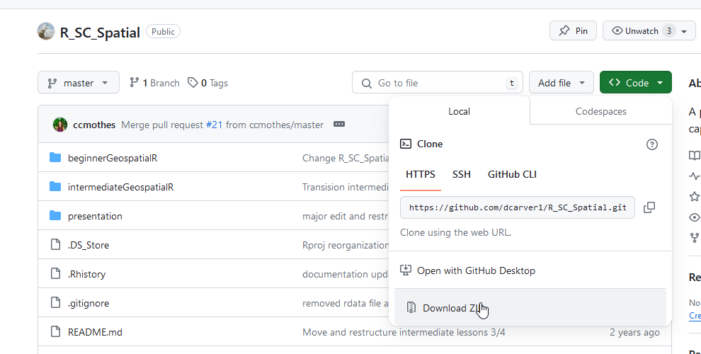

# Background

The programming language R has been in active development since 1995. While initially R was created for statistical computing, its popularity, flexibility, and open source development structure has allowed it to grow into something much more diverse. In this tutorial, we will showcase using R to import, manipulate, and visualize spatial data.

<br>

## Objective

- introduce spatial libraries (raster, sf, terra, tmap)

- read in raster data

- create a spatial dataset from a csv file

- spatial data analysis between vector and raster objects

- produce static and interactive maps

<br>

## How To

This tutorial is meant to be self-paced. To follow along, you will need to download the repository from the [github repo](https://github.com/dcarver1/R_SC_Spatial).

<br>


<br>


Select the dropdown arrow on the green code button. If you are familiar with using `git`, you can clone the repository by copying the url. Otherwise select `Download ZIP`. Extract the downloaded file to an appropriate location on your computer. 

Within the `R_SC_Spatial` folder is a series of sub-folders and files. 

- .gitignore : a text file that control what is track in version control 

- .Rhistory : a local file that stores your process with the R project

- beginnerGeospatialR : folder for the introduction to geospatial R lesson 

- intermediateGeospatialR : folder containing the lesson and material for the intermediate geospatial R lesson

- installPackages.R : a stand alone function that can be used to source in specific libraries 

- R_SC_Spatial.Rproj : An R project file use to efficiently work in a contained R environment. 


## Open the R_SC_Spatial.Rproj File

Double clicking this file will open R Studio and automatically set your working directly and established your file structure within the `file` viewer tab in the lower right side of the interface. 

Use this file navigation to open the `beginnerGeospatialR` folder.

Within the `beginnnerGeospatialR` folder, you will find the following files. Please do not alter the names or locations of these files as we will be referencing them throughout the lesson. 

- cucrbitaData.csv : reference plant occurrence data for the lesson. Pulled from [wild squash data](https://nph.onlinelibrary.wiley.com/doi/full/10.1002/ppp3.10085).  
- downloadRepo.png : image file 
- map.png : image file 
- proAreas.tif : A spatial data layer of protected areas within the study area of this tutorial. derived from [Protected Planet](https://www.protectedplanet.net/). 
- raster.tif : A multilayer raster showing the predicted distribution of the wild squash species of interest. 
- spatialR_brief.html : A browser readable version of the training material 
- spatialR_brief.rmd : A R Markdown file used to generate this training material. 


This material was developed using **R version 4.2.3**. 
Errors may arise if your version is different.
Check your version by typing r`version` into r console.

If you are interesting in changing your version of R there are a few options describing how to do so [here](https://stackoverflow.com/questions/13656699/update-r-using-rstudio).


# Conservation of Wild Squash 

The data being used in this lesson comes from a 2019 publication that looks at the conservation status of the wild relatives of squash. In the course of this lesson, we will be replicating one of the establish conservation metrics by determining the proportion of know occurrences that are within an established protected area. If you're interested in more spatial work in R, the entire workflow for the paper can be found [here](https://github.com/dcarver1/cwrSDM). As well as more recent work using [wild grapes](https://github.com/dcarver1/cwr_wildgrapes)

### Setting up your development environment. 

The core of the R programming language is already loaded into your environment when you install R. Yet, most of the specific analysis and visualizations you will perform in R require utilizing additional libraries. These libraries can be downloaded and installed from a central repository(CRAN) or even from github repositories is specific versions or unique libraries are required.  

We install packages using the `install.packages` function. 

We load packages into our local environment using the `library` function. 


We will be utilizing a few packages today 

**terra** : reading, writing and analysis of raster and vector datasets 

**sf** : reading, writing, and analysis of vector datasets 

**tmap** : visualization of spatial data

Install the packages one at a time then load them into your environment. 

As a general rule, it's only call install.packages() function when you need to install the package for the first time. To ensure this I've commented out the `install.packages()` lines to ensure they are not ran every time you run the code.  

```{r eval=FALSE, warning = FALSE}
# install sf first 
# install.packages("sf")
library(sf)

# install tmap 
# install.packages("tmap")
library(tmap)

# install terra
# install packages("terra")
library(terra)
```


<br>
We can view a summary of the package using the following command.
<br>
```{r eval=FALSE, warning = FALSE}

# Type this to view a list of the functions within the library in RStudio
help(package = "sf")
```
<br>


### Loading a Raster into R

We will rely on the terra library to bring in our first bit of spatial data.

<br>

Since the lesson is written in an R Project, your working directory should automatically be set to the correct place. R Projects are great, because you can write your script using relative paths and this allows you to ensure that the script will work on different computers. 

Just remember where your `.Rproj` file is stored and write all file paths starting from that location

<br>

```{r eval = TRUE, warning = FALSE}
# read in the file
# print it out to view some of the metadata
protectedLands <- terra::rast(x = "beginnerGeospatialR/proAreas.tif")
```
<br>
The raster is now stored in your environment. You should be able to see the `protectedLands` object in the data category of the Environment pane. 

We can plot the image to get a look at it. 
<br>

```{r eval = TRUE, warning = FALSE}
terra::plot(protectedLands)
```


Printing the object will give us some of the metadata associated with the file. 
<br>
```{r eval = TRUE, warning = FALSE}
# print to view some metadata 
print(protectedLands)
```

<br> 
Content from the print statement such as **extent** or **crs** can be selected using functions from the `terra` library and saved as R objects.  
```{r eval = TRUE, warning = FALSE}
# save some metadata from the raster to an object 
## spatial extent 
extent <- terra::ext(protectedLands)
## coordinate reference system  
crs <- terra::crs(protectedLands)
```
<br>


## Generate spatial data from a csv file
<br>

```{r eval = TRUE, warning = FALSE}
# read in the data
observationData <- read.csv("beginnerGeospatialR/cucurbitaData.csv")
# call the base r structure function to evaluate 
str(observationData)
```
<br>
There are a lot of observations here, so lets view it in more detail. 
```{r eval = TRUE, warning = FALSE}
# View(observationData) # if running in a an r script
head(observationData)
```


We can see there are multiple taxon present in the dataset. We want to run our evaluation on each unique taxon we will subset this data frame based on the column.

<br>

```{r eval = TRUE, warning = FALSE}
# view the unique species
unSpec <- unique(observationData$taxon)
unSpec

### subset all records associated with a species
# select our species of interest by indexing the list
species1 <- unSpec[1]
# filter the occurrence data set for all records where the taxon matches our
# species of interest.
species1_Data <- observationData[observationData$taxon == species1,]
 # observationData$taxon == species1 returns a vector of TRUE/FALSE values we use to select
 # rows from the observationData dataframe.

 # print a summary of the new subset  
str(species1_Data)
```
<br>

With the dataframe cleaned-up, we will use the **sf** library to generate a spatial object.

In order to create a spatial data object, we need to assign a coordinate reference system. From the details present in the source of our csv data, we know that the latitude and longitude values are recorded in unprojected lat lon using the WGS84 datum. We can find the specific reference for the crs using a helpful website [epsg.io](https://epsg.io). Our in our case, we can utilize an existing spatial object that has the same CRS that we want to assign to this object.     

```{r eval = TRUE, warning = FALSE}
# look at the names to get the correct column header for our x and y values
names(species1_Data)

#compile all elements into the function.
spatialData1 <- sf::st_as_sf(x = species1_Data,
                    coords = c("longitude","latitude"),
                    crs= terra::crs(protectedLands),
                    remove = FALSE) # Keeps the lat lon values in the dataframe. defaults to TRUE
# view the object
spatialData1
```
<br>
This object has all the data present within the original csv file but now there is a new `geometry` column. 
If we call the `class` function we can see what datatype this feature is. 
```{r eval = TRUE, warning = FALSE}
# view the data
class(spatialData1)
```
<br>

This is both an `sf` object and a `data.frame`. What this means is that you can still apply all the indexing and filtering methods that you would use on a data.frame to this object. At the same time, you can apply functions that are associated with the sf class feature. Like plotting the object 


```{r eval = TRUE, warning = FALSE}
plot(spatialData1)
```

The plot of the new spatial object shows all the individual columns with the latitude and longitude map below them. This is not a particularly informative visualization so lets utilizing a mapping specific library to get a better look.

<br>

```{r eval = TRUE, warning = FALSE}
# use the quick map function to visualize the data
tmap::qtm(spatialData1)
```
<br>

Ok, so that also didn’t give us much more information. We can improve this greatly by altering the parameters of the **tmap** library and generating an interactive map.

```{r eval = TRUE, warning = FALSE}
# use the quick map function to visualize the data
tmap::tmap_mode("view") # "plot" allows for static maps 
tmap::qtm(spatialData1)
```

<br>

This is much more interesting. We can finally see where we are at in the world and selecting the points provides information on their attributes. 

Note that these interactive maps can be exported at standalone html files. This can be a useful tool when sharing information with others. 


## Comparing the raster and vector data

<br>

Before we set into an analysis using the two data sets, we will evaluate how well they align spatially. Start by evaluating these two questions.

1. Do the coordinate reference systems match? 

2. Does the spatial extent of the object overlap? 

We will look at the coordinate reference system first because that is the most essential factor in all geospatial analyses. 

> If something is not working, assume it’s a projection issue first. 


<br>
```{r eval = TRUE, warning = FALSE}
# test the CRS of the objects 
terra::same.crs(spatialData1, protectedLands)
```

The `sf` library and `terra` library report the extent of object using a different data structure. That means we can not compare the results directly. For now, we will just visually inspect the outputs and evaluate. 

```{r eval = TRUE, warning = FALSE}
# check extent of the spatial data
sf::st_bbox(spatialData1)
``` 

```{r eval = TRUE, warning = FALSE}
# check the extent of the raster object
terra::ext(protectedLands)
```
<br>

The extents of the spatial objects are different, and the protectedLands layer is larger than the point object.

<br>

As the extents are different, it's worthwhile to clip the bigger data set to improve processing time and keep a clean study area.  
<br>

## A quick word on the state of spatial data libraries 01-2024 

In October 2023, formal support for the  `sp` and `raster` libraries has been dropped. These libraries are still available in R but because of outdated dependencies, they will become less and less stable over time. 

This means that most spatial data analysis in R in 2024 will be using a combination `sf` and `terra`. 

Currently, these libraries do not directly integrate. You can not pass a `sf` vector layer into a `terra` processing function. 

The solution is to convert the `sf` object to a `terra::vect` object and run the process. 

There are likely many cases where all the work can be done solely in the `terra` library. However, this is not always true. As a result, we will be move between these two object types within this lesson. 

## Crop the Data

To crop our raster layer we need to create a `terra` version of our spatial data.
<br>
```{r  warning = FALSE}
# convert to terra 
spatialData1_terra <- terra::vect(spatialData1)

# Crop the protected areas to the extent of the points
cropped_protectedLands <- terra::crop(x = protectedLands, y = spatialData1_terra)

#quick visual check the crop. 
tmap::qtm(cropped_protectedLands)
```
<br>

This type of trimming is often an important step in a geospatial workflow. Spatial data tends to be large. More information requires more processing and more time. 
```{r warning = FALSE}
# look at the different file size of the two raster objects
paste0("Number of unique cells in cropped feature:", terra::size(cropped_protectedLands))
paste0("Number of unique cells in full feature:",terra::size(protectedLands))

```
<br>


The extent and file size has shrunk quite a bit and we can now be sure that the dataset match in extent as well. That gives us the go ahead for the spatial analysis between the layers. 

<br>

## Extracting Values to Points

<br>

We will use our points and protected lands raster to determine which (if any) of the occurrences are found within protected lands through an extraction. This will pull the value of the raster based on the location of the point data. We can read the specifics in the documentation. 
<br>

```{r eval = TRUE, warning = FALSE}
# extract values
?terra::extract
```
<br>

```{r warning = FALSE}
# extract returns a vector of length(y), therefore we can just add that
# data as new column to our spatial points dataframe
extractedValues <- terra::extract(x = cropped_protectedLands,
                                                    y = spatialData1_terra)

head(extractedValues)
```
## Calculating conservation assessment. 

For this single metric, we wanted to know the proportion of occurrences present in a protected area. This higher number of records from protected areas implies better long-term conservation as these ecosystems are less likely to be developed or exposed to invasive land uses.  

```{r eval = TRUE, warning = FALSE}
totalProtected <- nrow(spatialData1[!is.na(spatialData1$protectedLands),])
conservationMertic <- 100*(totalProtected/nrow(spatialData1)) 
conservationMerticRounded <- round(x = conservationMertic, digits = 2) 
```


<br>

## Map the Data


With the result captured, we can append that data back to our spatial point object so it can be visualized on the map.
Were going to use our `sf` object to do this as `tmap` currently does not support the `terra::vect()` object class. This is likely something that will change in the future.  

<br>
```{r eval = TRUE, warning = FALSE}
spatialData1$protectedLands <- extractedValues$proAreas
head(spatialData1)
```


<br>

We will start by visualizing the occurrence data on an interactive map using the library tmap.
<br>

```{r warning = FALSE}
# map the points
map <- tmap::tm_shape(shp = spatialData1)+
  tmap::tm_dots(col = "protectedLands", 
                size = 0.1,
                title = "Occurrences in Protected Areas",
                )+
  tmap::tm_layout(
    title = paste0(conservationMerticRounded, " percent of observations of ",
                   spatialData1$taxon[1], " are within a protected area")
    
  )
map
```
<br>

The "map" is stored as a tmap object name `map`. This is helpful because we can easily add new layers to the existing object.
<br>

```{r warning = FALSE}
# add the raster to the map
map2 <- map +
  tmap::tm_shape(cropped_protectedLands) +
    tmap::tm_raster(alpha = 0.4,palette = "green", title = "Protected Areas")
map2
```
<br>
Because we added the protected areas layer on top of the existing map object, we used the visualization parameter 'alpha' to adjust the transparency so we can still see the occurrence data beneath it.

We can also edit the basemap of this feature to provide some more spatial context to the area. 
<br>

```{r warning = FALSE}
# set the map to interactive and adjust the base map
map2 + tmap::tm_basemap("OpenStreetMap")
```


## Conclusion 

R is a remarkably useful tool for performing spatial data analysis and visualization. We covered some core concepts today that were aimed at defining the basics. There is a lot more to learn and that is always easiest when you have a reason to learn it. Find a problem worth evaluating and start trying to figure out how to understand it. Good luck! 


## Challenge
<br>
Use a for loop and a function to generate the protected points map for each species in the species list.
<br>

```{r eval = FALSE, warning = FALSE}
#hint
for(i in speciesList){
  map <- function(i){
    # subset data
    # read in raster
    # crop raster
    # extract values
    # map content
    return(map)
  }
  tmap::tmap_save(tm = map, filename = paste0(i,"_protectedOccurrences.png"))
}
```
